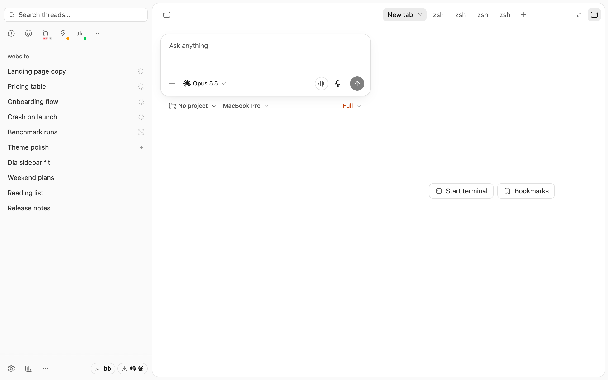

# San Francisco

San Francisco is a BB theme in the quiet macOS style of the
[Aside](https://aside.com) browser. The content sits on the gray window frame
as one white card, text is set in the system font (SF Pro on a Mac), and
hierarchy comes from shades of gray rather than lines. Text is at least as
easy to read as in BB's default palette. One accent color, chosen from the
eight macOS accents, underlines links and colors file names, focus rings,
selections, switches and checkboxes.



The theme restyles:

- **Sidebar**: rows and their icons share one soft black, group labels are
  gray, and the open thread is a white pill. Search threads becomes a search
  field. On a desktop the sidebar loses its row of back and forward buttons
  and starts at the top of the window, or below the window buttons in BB's
  Mac app. The sidebar button opens the thread's header as the right panel's
  button ends it, open or closed.
- **Composer**: larger corners, a soft shadow, and one round send button with
  an up arrow, gray while there is nothing to send and black once there is.
  Stop, the voice button and the recording check are the same circle, one
  size in every state.
- **Above the composer**: background work becomes one outlined card, and
  queued messages a sheet tucked behind the composer.
- **Right panel**: quiet tabs, and a new tab that centers its hint above
  outlined buttons.
- **Settings**: a Settings › Page breadcrumb, a large page title, small-caps
  section headings, and rows in cards split by full-width lines.
- **Controls and menus**: lighter buttons, inputs and badges, selects sized to
  their text, and checkboxes filled with the accent. Menus and popovers are
  compact, and the model picker's reasoning levels are a segmented control.
  Surfaces stay flat; only the composer and what floats above the page, such
  as menus, popovers, dialogs, toasts and the command palette, cast a soft
  shadow. Provider marks keep their shape but take the text color.

Dark mode follows the same rules: a near-black frame, a slightly lighter card,
and near-white text. The card is lighter than BB's, so gray text, accent text
and BB's terminal, diff, status and code colors are brighter to match.

## Use

- Choose **San Francisco** under **Settings → Appearance → Palette**, or run
  `bb theme set plugin:san-francisco:san-francisco`. The palette applies to
  every window on this BB server.
- Choose the accent from the swatches under **Settings → San Francisco**, or
  run `bb plugin config san-francisco set accent Green`. The accents are Blue
  (the default), Purple, Pink, Red, Orange, Yellow, Green and Graphite.
- Light and dark follow BB's **Theme** setting, which each device keeps for
  itself.
- **Search threads** becomes a field only while it is visible in the sidebar
  navigation. If you hid it, show it again with **More → Customize sidebar**.
  The field works with both BB's list and Superhuman's Dia Sidebar grid of
  icons, and shows your Search threads shortcut when one is set. On a phone
  with Superhuman's Phone layout, the grid stays one row of icons lined up
  with the thread's bar, so Search threads stays an icon there.
- To return to BB's look, choose **Default** under **Palette** or run
  `bb theme reset`.

## How it works

- The plugin adds one BB theme (`bb.themes`), `themes/san-francisco.css`. BB
  keeps the chosen palette on the server and applies it before the first
  paint.
- The accent is a plugin setting. The plugin's frontend shows it as a row of
  swatches in place of BB's select, and mirrors it to `data-sf-accent` on
  `<html>`; the stylesheet defines each accent's colors under that attribute.
  Blue is the stylesheet's own color, so it needs no attribute. BB loads plugin
  frontends after the first paint, so another accent replaces Blue a moment
  after BB opens. Other palettes ignore the attribute.
- A content script names the open settings page in `data-sf-page` (the header)
  and `data-sf-page-title` (the content column), and the stylesheet draws the
  breadcrumb and the large title from them. The script watches the page only
  while San Francisco is the active palette, which it detects from the
  `--sf-accent` token. The same script holds an open menu in place while BB
  previews another palette under it, so the menu doesn't jump under the
  pointer.
- On desktop, a content script tracks window and sidebar structure in data
  attributes without reading geometry. It replaces the theme's matching CSS
  conditions with those attributes so thread updates avoid broad style
  recalculation. The original rules provide the first paint and return when
  the script stops.
- Palette, fonts, text sizes, radii, shadows and icon stroke are BB theme
  tokens, set in the `:root, .light` and `.dark` blocks. The other rules target
  BB 0.43.4's markup: data attributes and roles where BB has them, Tailwind
  utility combinations where it doesn't. BB's utilities live in cascade layers,
  so the unlayered rules win without `!important`. The few rules that meet
  inline styles, BB's layered `!important` utilities or other plugins' rules
  explain their workaround in a comment.
- `npm test` checks that each text color has at least the contrast it has in
  BB's default palette, on every surface it can appear on, in light and dark
  mode. The terminal's bright white is the one exception: it is already
  white, and the dark card is lighter than BB's.
- BB's markup isn't a versioned API, so a BB update can break selectors.
  `npm run test:browser` checks the main ones against a running BB.

## Install

San Francisco needs BB 0.43.4 or later. Installing adds the palette without
switching to it.

```sh
bb marketplace add git:https://github.com/rebryk/bb-plugins.git@main
bb plugin install san-francisco@sf-plugins
```

Use `bb plugin install .` from this directory instead when working on it
locally.

## Development

```sh
npm ci
npm test
npm run typecheck
npm run build
npm run test:browser
bb plugin reload san-francisco
```

`npm run test:browser` needs a running BB and a fresh `npm run build`. It uses
Google Chrome, or Playwright's Chromium when Chrome isn't installed. It serves
this directory's theme and frontend to one headless page and drops that page's
writes, so your palette and plugins stay as they are.

## More San Francisco Plugins

San Francisco is one of the
[San Francisco Plugins](https://github.com/rebryk/bb-plugins), a family of BB
plugins. The others:

- [Superhuman](../superhuman): Superhuman-style speed for BB, with shortcut
  hints, snooze, a compact grid of navigation icons, and a phone layout.
- [Bookmarks](../bookmarks): save any chat message and jump back to it from the
  thread's right panel.
- [Pool Usage](../pool-usage): how much of each provider's capacity is in use
  and when it frees up, in the sidebar footer.
